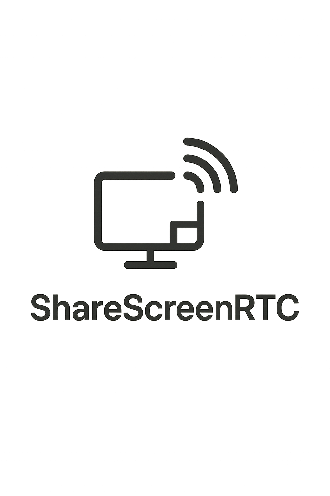

<p align="center">
  
</p>

<h1 align="center">ShareScreenRTC</h1>

ShareScreenRTC is a web application for sharing and viewing live video streams using WebRTC technology.

The app allows you to broadcast your screen or view a broadcast using a modern browser. A Python server is used to automate the signaling process, so you don't need to manually copy and paste the WebRTC offer and answer. With the server, you can simply scan a QR code on your phone and instantly join the stream.

## Features

- Live screen sharing and viewing via WebRTC
- Signaling automation using a simple Python server
- QR code support for easy connection from mobile devices
- No manual copying of SDP offer/answer required when using the server

## How to run the application

ShareScreenRTC consists of two server components, both implemented in pure Python using only standard libraries. **You do not need to install any dependencies or use pip.**

### 1. Start the signaling server

In your project directory, run:

```sh
python3 server.py
```
or, on Windows:
```sh
python server.py
```

The signaling server will listen on port 5000 by default.

### 2. Start the static web server

You also need to serve the static web files (such as `index.html`, JavaScript, CSS, etc.) using Python’s built-in HTTP server.  
In a second terminal window, run:

```sh
python -m http.server 80
```

This will serve the web interface on [http://localhost](http://localhost).

> **Note:**  
> Make sure to run **both servers at the same time**:  
> - The HTTP server serves the web interface on port 80  
> - The signaling server handles WebRTC signaling on port 5000

## Accessing the application

Once both servers are running:

1. Open your browser and go to [http://localhost](http://localhost)
2. Start a broadcast or join a broadcast using the web interface

## Requirements

- Python 3.x (pre-installed on most systems)
- A modern web browser (Chrome, Firefox, Edge, etc.)

No additional Python packages or installations are required.

## Troubleshooting

- **Permission denied or "Address already in use" on port 80:**  
  You may need to run your terminal as Administrator/root, or use another port (e.g. `python -m http.server 8080` and open [http://localhost:8080](http://localhost:8080))

- **Cannot access `server.py` from your browser:**  
  Remember, the signaling server (`server.py`) does not serve the web interface. It only handles signaling for WebRTC.  
  The web interface is served by the HTTP server on port 80.

- **Screen sharing not working on mobile browsers:**  
  Most mobile browsers do **not** support screen sharing via WebRTC. Use a desktop browser for broadcasting your screen. Mobile devices can join as viewers via QR code.
