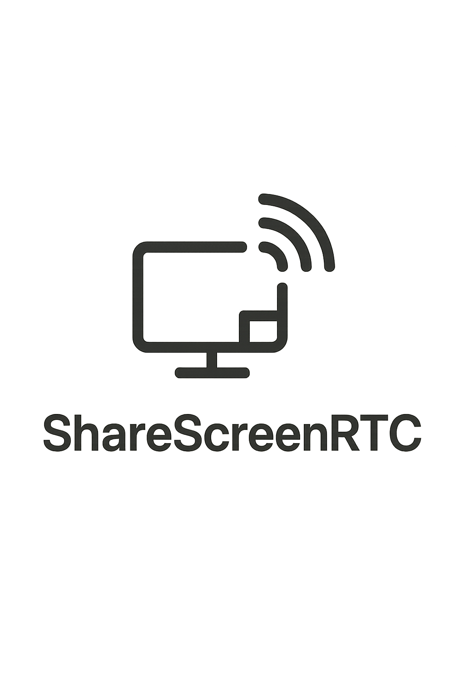

  

<h1 align="center">ShareScreenRTC</h1>

ShareScreenRTC is a serverless WebRTC screen sharing page.

- Start broadcast on computer.
- Scan QR on phone to join.
- Phone generates only one value: compact response token.
- On computer, paste compact token, then apply it.

No Python signaling server is required.

## Flow

1. Broadcaster clicks **Start Broadcast**.
2. Broadcaster shows offer QR to phone.
3. Phone opens viewer mode from QR and generates compact token.
4. Broadcaster pastes compact token, then clicks **Apply Response**.

## Run options

### Option A: Local file
Open `index.html` directly.

### Option B: Static host URL
Host the files on any static site.

Both devices should be on the same Wi‑Fi/local network.

## Notes

- Uses `RTCPeerConnection({ iceServers: [] })` for local network behavior.
- `server.py` is not needed in this workflow.
- If QR image does not appear, use the shown Broadcast URL text directly.
- To keep payloads small, SDP is reduced to minimal LAN candidates before encoding.
- The phone page opened from QR is intentionally minimal: just video stream + answer token output.
